BEM VINDO A QUADRADAS!

O projeto tem como objetivo desenvolver um site para facilitar a locação de quadras esportivas, tornando o processo mais simples, organizado e acessível tanto para os clientes quanto para os administradores.

FUNCIONALIDADES

- Usuário não logado
  
Página inicial
Visualizar quadras disponíveis
Ver informações da quadra
Consultar preços
Consultar horários disponíveis
Pesquisar/filtrar quadras
Fazer cadastro
Fazer login

- Usuário logado

Realizar reserva
Visualizar minhas reservas
Cancelar uma reserva
Editar dados do perfil
Consultar histórico de reservas

- Administrador

Cadastrar quadras
Editar/excluir quadras
Cadastrar e alterar horários
Bloquear horários
Visualizar reservas
Cancelar/alterar reservas
Gerenciar usuários

#locacaodequadra

    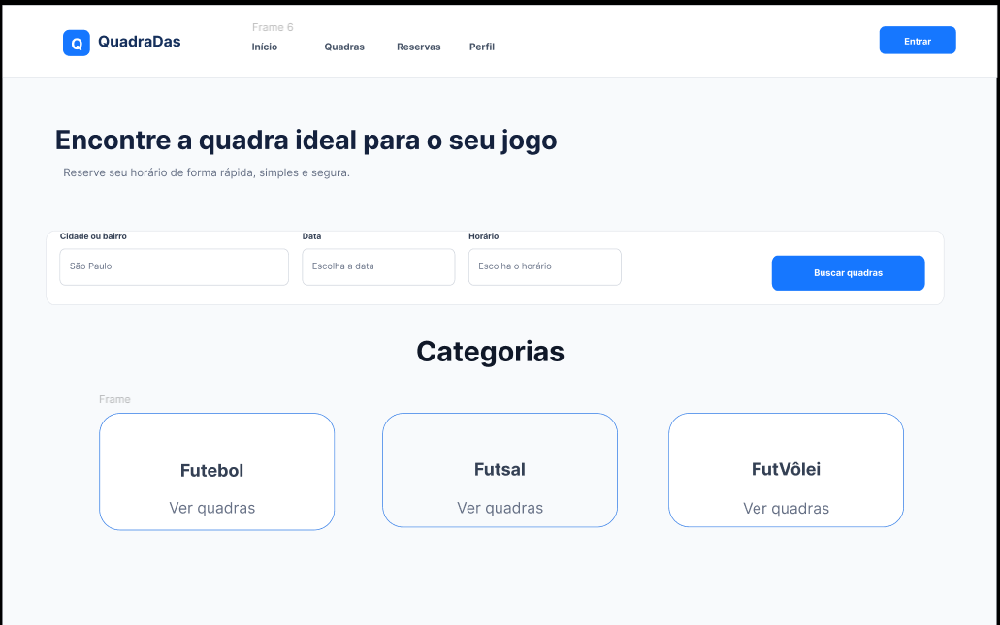
    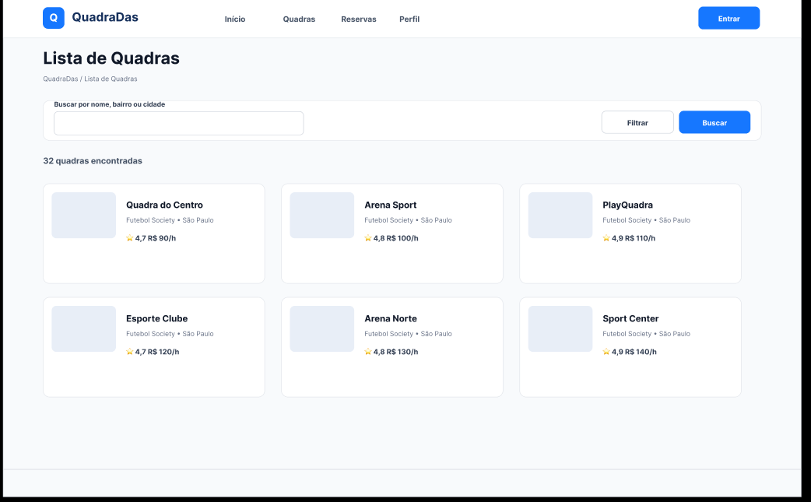
    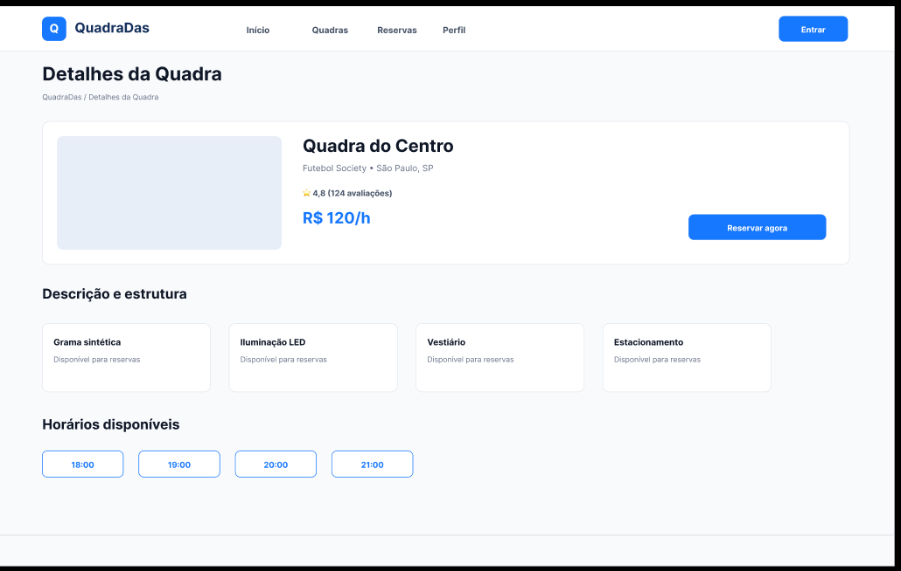
    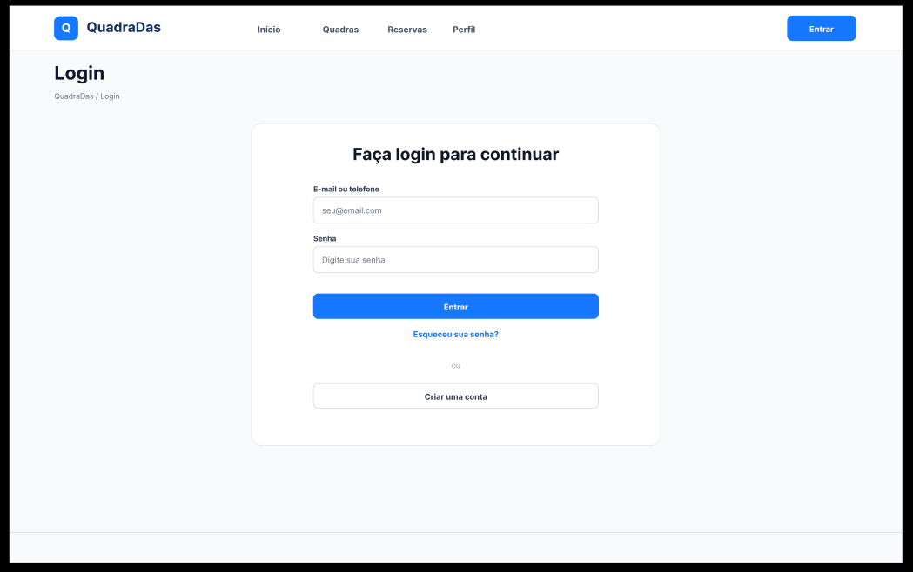
    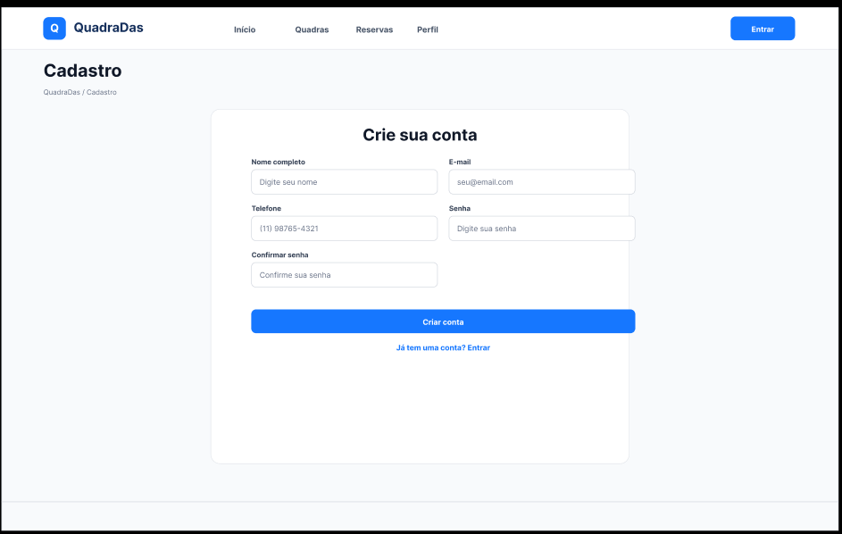
    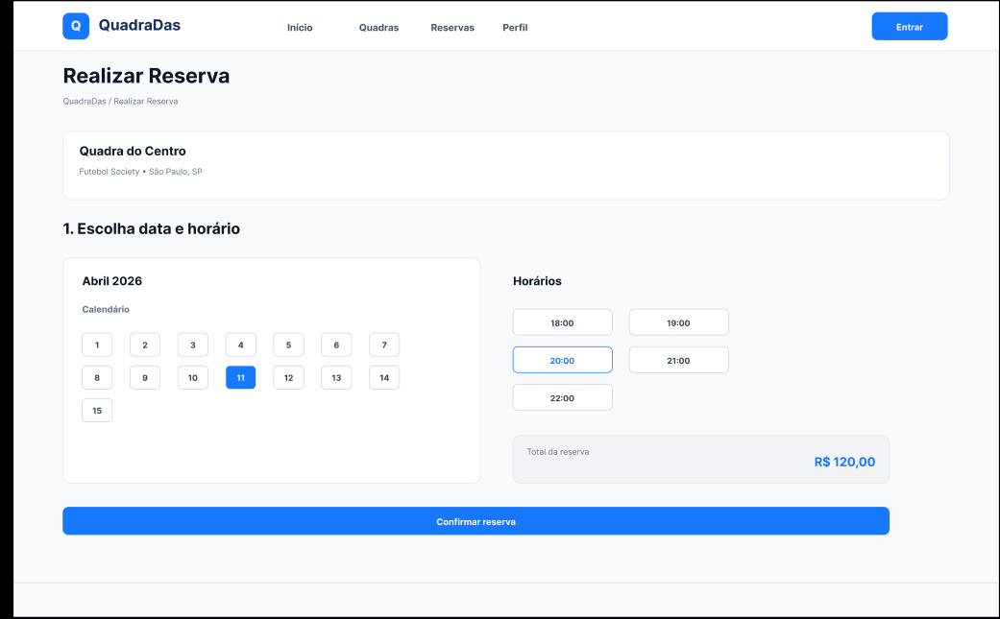
    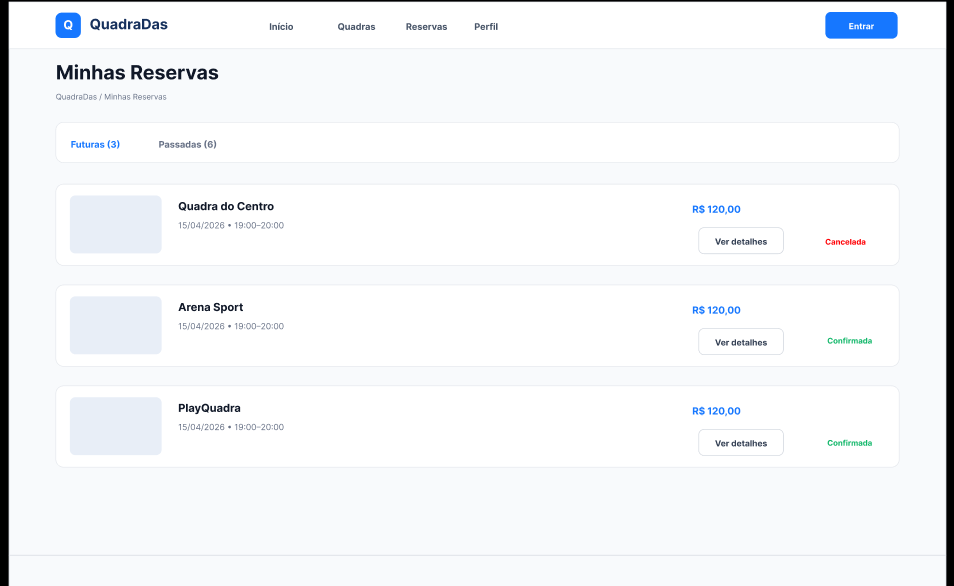
    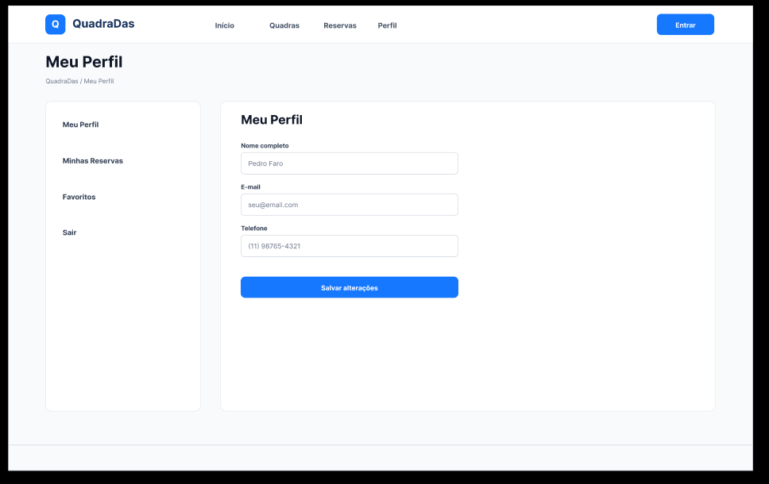
    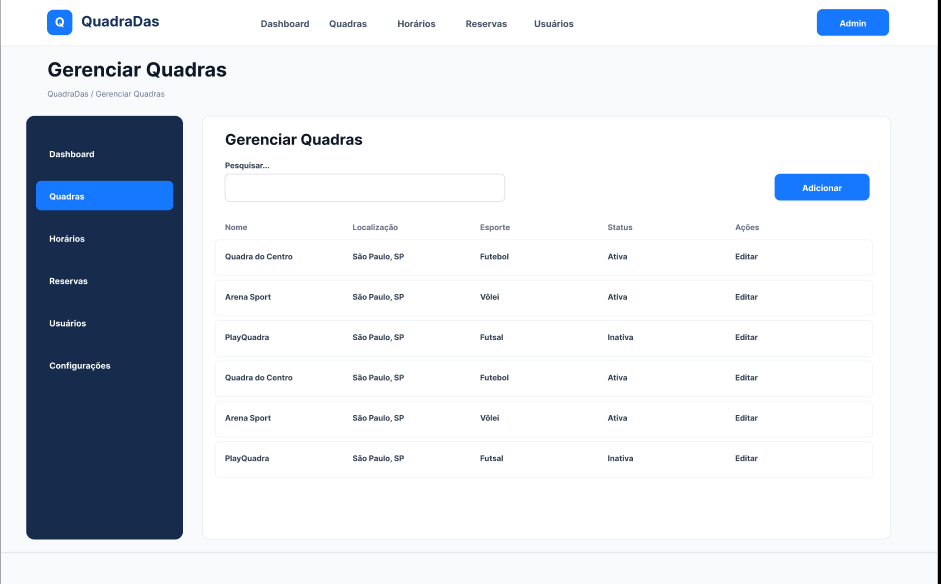
    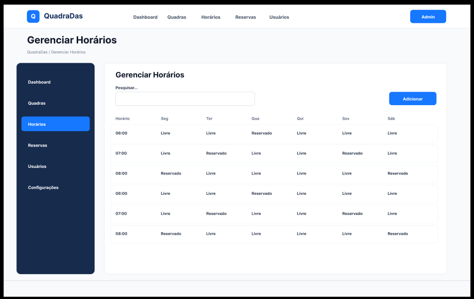
    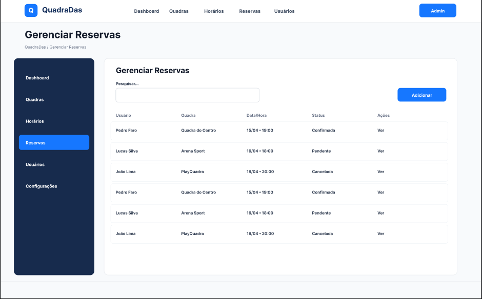
    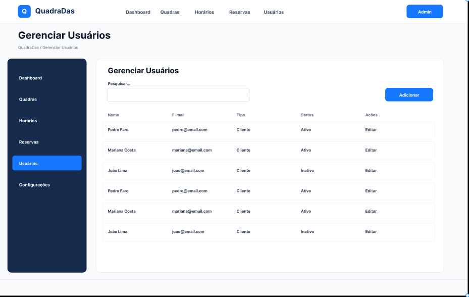

